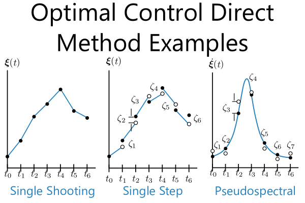

## README (optimal-control-direct-method-examples)

[](https://github.com/danielrherber/optimal-control-direct-method-examples/releases/latest)
[](https://github.com/danielrherber/optimal-control-direct-method-examples/blob/master/License)

[](https://www.mathworks.com/products/matlab.html)
[](https://github.com/danielrherber/optimal-control-direct-method-examples/issues)
[](https://github.com/danielrherber/optimal-control-direct-method-examples/graphs/contributors)
[](https://gitter.im/optimal-control-direct-method-examples/community)

Teaching examples for three direct methods for solving optimal control problems, namely [single shooting](src/Method_SingleShooting.m), [single step](src/Method_SingleStep.m), and [pseudospectral](src/Method_Pseudospectral.m).



---
### Install
- Download the [project files](https://github.com/danielrherber/optimal-control-direct-method-examples/archive/master.zip)
- Run [INSTALL_Direct_Method_Examples.m](INSTALL_Direct_Method_Examples.m) in the MATLAB Command Window *(automatically adds project files to your MATLAB path, downloads the required files, and opens an example)*
```matlab
INSTALL_Direct_Method_Examples
```
- See [Run_All_Examples.m](src/Run_All_Examples.m) to run all the examples or the individual examples in `/src`
```matlab
Run_All_Examples
```

### External Includes
See [INSTALL_Direct_Method_Examples.m](INSTALL_Direct_Method_Examples.m) for more information
- **MATLAB File Exchange Submission IDs** (51104, 65434)

### MATLAB Version
The main methods should work on version R2014b or newer.
[Method_DTQPProject.m](optional/Method_DTQPProject.m) requires version R2016a or newer.
Some of the plot decorations require newer versions that support structure properties in figures.
The [Optimization Toolbox](https://www.mathworks.com/products/optimization.html) is required.

---
### Bryson-Denham Problem

This is the optimal control problem used in the examples. The problem formulation is:


The optimal control solution when `\ell` is between 0 and 1/6 is:


Please see the following files that calculate the optimal [states](src/bryson-denham/BrysonDenham_Solution_States.m) and [control](src/bryson-denham/BrysonDenham_Solution_Control.m). See pages 120–123 of *A. E. Bryson and Y.-C. Ho, Applied Optimal Control, revised printing ed. Taylor & Francis, 1975* for more details on this problem.

---
### General Information

#### Contributors
- [Daniel R. Herber](https://github.com/danielrherber)

#### Project Links
- [https://github.com/danielrherber/optimal-control-direct-method-examples](https://github.com/danielrherber/optimal-control-direct-method-examples)
- [http://www.mathworks.com/matlabcentral/fileexchange/62546](http://www.mathworks.com/matlabcentral/fileexchange/62546)